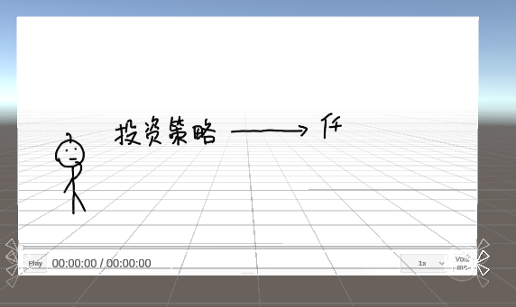
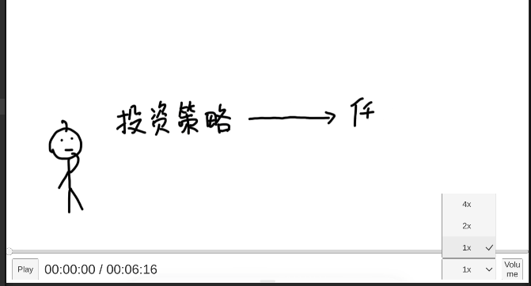

参考 【unity制作视频播放功能  (播放,暂停,跳播,进度条,音量调节,倍速播放,控制栏动画)】 https://www.bilibili.com/video/BV1vg4y1n7BK/?share_source=copy_web&vd_source=57dbd16b8c7c2ad258cccce5966c5be8 做的 VideoPlayer UGUI 的 UI封装。

unity制作视频播放功能--播放,暂停,跳播,进度条,音量调节,倍速播放,控制栏动画

代码有些许不同和改进

